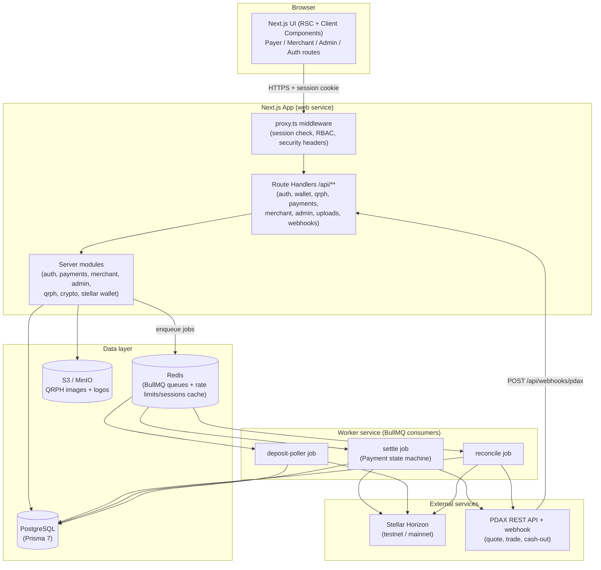
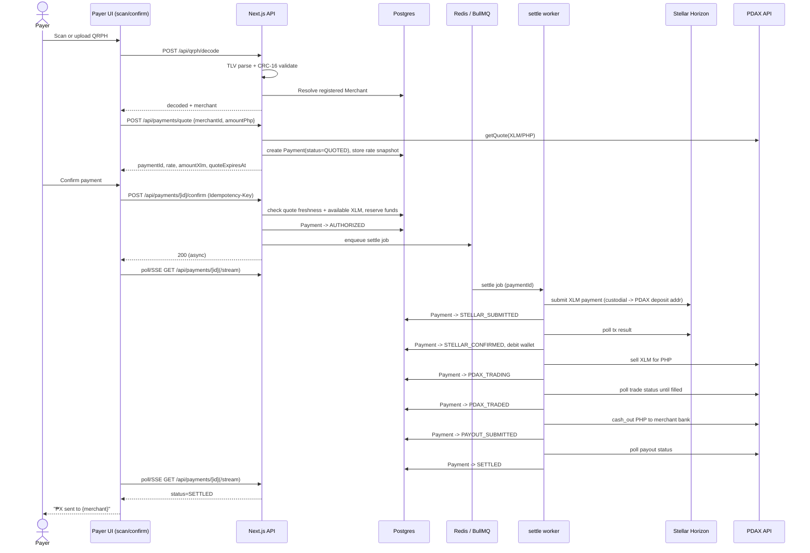
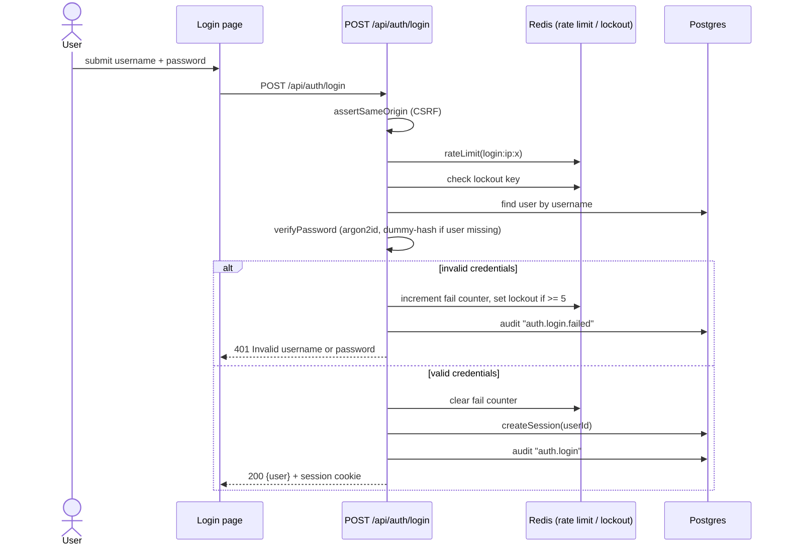
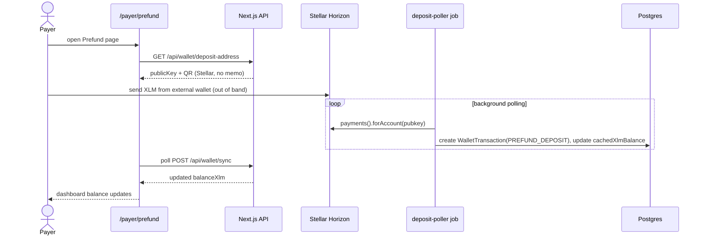
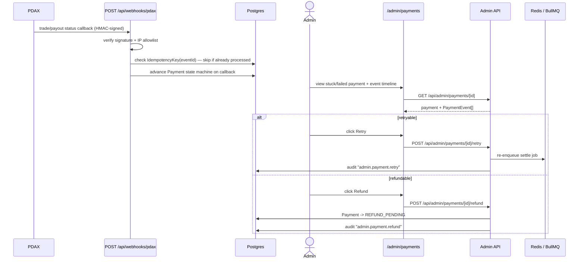
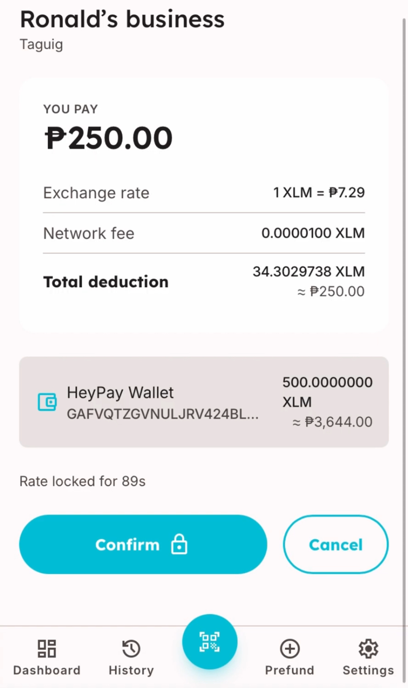
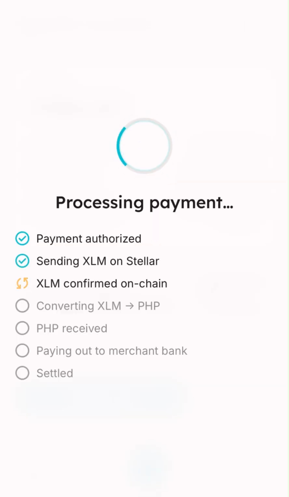
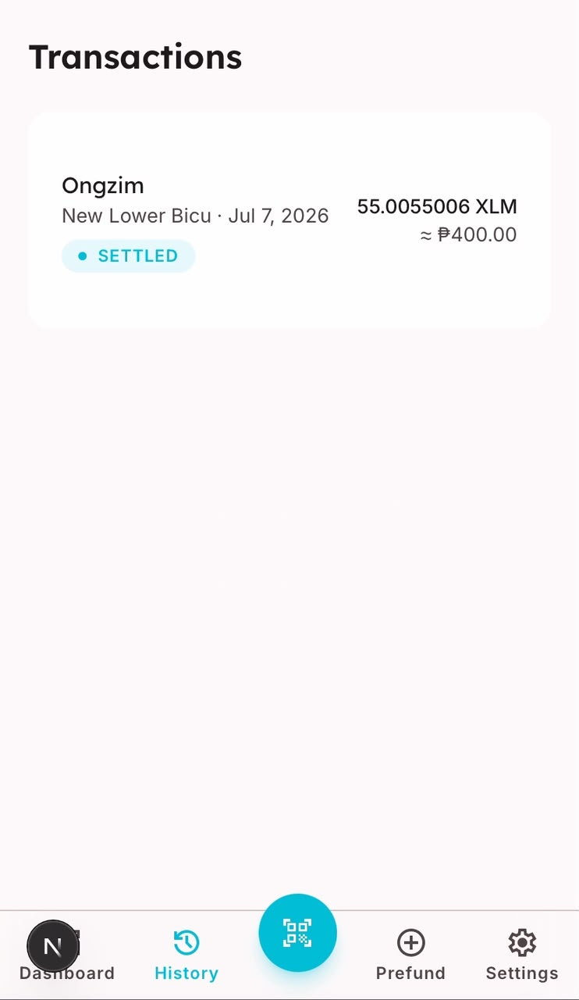

# HeyPay

> Pay any QRPH merchant in the Philippines straight from your Stellar (XLM) balance.

HeyPay is a fintech bridge between the Stellar network and the Philippines' national QR payment standard: a **Payer** prefunds a HeyPay-custodied Stellar wallet with XLM, scans any existing **QRPH** merchant code — the same code every BSP-regulated PH merchant already accepts — and pays. HeyPay submits the XLM payment on the Stellar network, converts it to PHP through the PDAX exchange, and settles the PHP directly into the **Merchant's** bank account, with no merchant-side integration work required. The hero flow: scan QRPH → confirm a live XLM→PHP quote → HeyPay moves the XLM on Stellar, sells it for PHP on PDAX, and pays out to the merchant's bank, with the payer watching a live status overlay track every step through to settlement. An **Admin** operator has full visibility and manual intervention (retry/refund) over the same pipeline.

For the Stellar ecosystem, HeyPay is a concrete instance of "everyday spending utility" for XLM — the missing last mile that turns a held crypto balance into a real-world payment accepted by ordinary merchants, in one of Stellar's most active real-world corridors (Philippine remittance and payments, alongside partners like Coins.ph and MoneyGram already live on Stellar). As shipped today it is a **complete but narrow, single-rail application**: every payer/merchant/admin flow in `SPEC.md` is implemented end to end, but it relies on exactly one custodial asset (XLM only), one conversion counterparty (PDAX, integrated as a plain REST API rather than through any Stellar-native anchor protocol), and no on-chain settlement logic beyond a classic Horizon payment operation — no SEPs, no Stellar DEX, no Soroban. Its ecosystem impact today is real but local and demonstrative rather than structural; see [Ecosystem Roadmap](#ecosystem-roadmap--research) below for how SEP-based anchors, USDC, on-chain path payments, and Soroban escrow contracts could turn it into reusable Stellar infrastructure rather than a single app.

## Status / License

|         |                                                                                                                                                                                                                                                                                                                                                                                                                                                                                                                                     |
| ------- | ----------------------------------------------------------------------------------------------------------------------------------------------------------------------------------------------------------------------------------------------------------------------------------------------------------------------------------------------------------------------------------------------------------------------------------------------------------------------------------------------------------------------------------- |
| Version | `0.1.0` (`package.json`)                                                                                                                                                                                                                                                                                                                                                                                                                                                                                                            |
| Status  | **Feature-complete against `SPEC.md`.** Auth, payer (prefund/scan/pay/history/settings), merchant (onboarding/dashboard/transactions/QR/settings), and admin (users/merchants/payments/health) surfaces are all implemented, backed by 56 unit/integration test files and a 4-spec Playwright e2e suite wired into CI, with a Railway deployment config (`railway.json` + `Dockerfile`). No Soroban/on-chain contract layer exists — see [Smart Contracts](#smart-contracts) and [Ecosystem Roadmap](#ecosystem-roadmap--research). |
| License | MIT — see [`LICENSE`](LICENSE)                                                                                                                                                                                                                                                                                                                                                                                                                                                                                                      |

## Problem

Philippine merchants overwhelmingly accept payment through **QRPH**, the BSP's EMVCo-based national QR standard tied to PHP bank accounts (SPEC.md §1). Meanwhile, someone holding **XLM** has no direct way to pay at those merchants — they would need to off-ramp to PHP through a separate exchange before they could pay anyone. HeyPay closes that gap: it is a custodial bridge that lets a payer spend XLM at any merchant who already accepts QRPH, with no merchant-side integration work required (SPEC.md §1, "Happy path").

## Vision / Purpose

Per `SPEC.md`, HeyPay's v1 scope is a **web-only production-shaped MVP**: custodial Stellar wallets, PDAX-mediated XLM→PHP conversion, PHP cash-out to a merchant's registered bank account, and an admin console for operational oversight — with `MOCK` and `PDAX` (staging) provider modes so the full flow can be demonstrated without real money movement (SPEC.md §1 "Explicitly out of scope"). The long-term intent (per SPEC.md §1) is a foundation that can later add USDT/USDC as payment assets, real KYC/AML/OTP flows, and mobile apps — all currently modeled but explicitly deferred. `AGENT.md`/`auto-dev.md` and the `docs/superpowers/plans` directory show the project being built sprint-by-sprint by an AI coding agent against a fixed spec [inferred].

## Target Users

- **Payers** — XLM holders who want to spend crypto at everyday PH merchants without manually off-ramping first.
- **Merchants** — PH businesses that already accept QRPH and want to receive PHP from crypto-holding customers with zero extra integration (they just register their existing QR + bank account).
- **Admins** — operators with full visibility into users, merchants, and payment health, plus manual retry/refund controls over stuck or failed settlements (SPEC.md §2, §5).

## Features

Grounded in `src/`, all implemented and matching `SPEC.md`:

**Auth & accounts**

- Username/password signup and login with argon2id hashing, timing-safe dummy-hash comparison, IP + username rate limiting and lockout, and server-side sessions (`src/app/api/auth/*`, `src/server/auth/*`).
- CSRF protection via same-origin checks on all mutating routes (`src/server/auth/csrf.ts`) and role-based route access enforced in `src/proxy.ts` (Next.js middleware).
- Audit logging of security-relevant actions (`src/server/auth/audit.ts`).

**Payer**

- Custodial Stellar wallet per payer, generated and envelope-encrypted at signup (`src/server/stellar/wallet.ts`, `src/server/crypto/envelope.ts` — AES-256-GCM).
- Prefund flow: deposit address + QR, background deposit detection (`src/app/(payer)/payer/prefund`, `src/server/queue/jobs/deposit-poller.ts`).
- QRPH scanning via camera (`getUserMedia` + `jsQR`) or image upload, decoded server-side with a real EMVCo TLV parser and CRC-16 validation (`src/server/qrph/{tlv,crc,decode,resolve}.ts`).
- Live rate quoting with a TTL-bound rate lock, funds-sufficiency checks, and idempotent payment confirmation (`src/server/payments/{quote,confirm,idempotency}.ts`).
- A `Payment` state machine (`CREATED → … → SETTLED/FAILED/REFUNDED`) driven asynchronously by a BullMQ worker, with a live-polling (and SSE-streamed) processing overlay in the UI (`src/server/payments/state-machine.ts`, `src/server/queue/jobs/settle.ts`, `src/app/(payer)/payer/pay/[paymentId]/confirm`, `GET /api/payments/[id]/stream`).
- Personal transaction history with a detail drawer showing the full `PaymentEvent` timeline (`src/app/(payer)/payer/transactions`).
- Dashboard with live-polled balance, recent payments, and a network-status indicator (`src/app/(payer)/payer/dashboard`).

**Merchant**

- 4-step onboarding wizard (business identity → settlement bank → QRPH link → review/go-live) with a live payer-facing preview pane (`src/app/(merchant)/merchant/onboarding`, `src/components/merchant/onboarding/*`).
- Bank-account validation against a supported-bank list, with the account number envelope-encrypted at rest and only a masked last-4 exposed (`src/server/merchant/banks.ts`, `src/app/api/merchant/settlement`).
- QRPH upload/link with CRC validation and cross-merchant uniqueness enforcement (`src/app/api/merchant/qrph`).
- Go-live completeness gate (`ACTIVE` or `PENDING_REVIEW` behind a `MERCHANT_REVIEW_GATE` flag) (`src/app/api/merchant/go-live`).
- Dashboard with earnings (total settled PHP, month-over-month change), pending XLM trades, and a business transactions table (`src/app/(merchant)/merchant/dashboard`).
- Business QR page (SVG + shareable payment link), a filterable/paginated transactions page, and a settings page (business/logo/bank/QRPH/password edit) (`src/app/(merchant)/merchant/{qr,transactions,settings}`).

**Admin**

- User management: list/search, activate/deactivate (`src/app/(admin)/admin/users`, `src/server/admin/users.ts`).
- Merchant review: search/filter, status transitions (`DRAFT`/`PENDING_REVIEW`/`ACTIVE`/`SUSPENDED`) (`src/app/(admin)/admin/merchants`, `src/server/admin/merchants.ts`).
- Payments: full listing with per-payment event timeline, plus manual **retry** (re-enqueues the settle job, gated to retryable statuses) and **refund** (moves a payment to `REFUND_PENDING`, gated to refundable statuses) — both audit-logged (`src/app/(admin)/admin/payments`, `src/server/admin/payments.ts`).
- System health dashboard: live checks against Stellar Horizon, PDAX (or "mock rail"), Redis, and BullMQ queue depth (waiting/active/delayed/failed) (`src/app/(admin)/admin/health`, `src/server/admin/health.ts`).

**Platform / infra**

- `PaymentRailProvider` abstraction with a deterministic `MockProvider` and a `PdaxProvider` for real PDAX integration (HMAC request signing + TOTP, retry/backoff), switched via `PAYMENT_RAIL` (`src/server/rails/{provider,mock,pdax,index}.ts`).
- BullMQ-driven worker process running the settlement state machine, deposit poller, and a balance-reconciliation job (`src/worker/index.ts`, `src/server/queue/*`).
- File uploads via true S3 presigned-POST (content-type allowlist, size cap, post-upload magic-byte + size re-validation) for QRPH images and merchant logos (`src/app/api/uploads/presign`, `src/server/storage/s3.ts`).
- PDAX webhook receiver: HMAC-SHA256 signature verification (constant-time compare) + optional IP allowlist, idempotent by `eventId` via the `IdempotencyKey` table (`src/app/api/webhooks/pdax`).
- Liveness health endpoint for Railway (`GET /api/health` — checks DB + Redis) separate from the deeper admin health dashboard.
- Security headers applied to every response (`src/lib/security-headers.ts`, wired through `proxy.ts`).

**Testing & deployment**

- 56 unit/integration/component test files (Vitest + Testing Library) plus a 4-spec Playwright e2e suite (`tests/e2e/{payer-happy-path,merchant-go-live,merchant-qr,admin-retry-refund}.spec.ts`) covering signup → prefund → scan → pay → settle, merchant onboarding → go-live, the business QR page, and admin retry/refund — all wired into `.github/workflows/ci.yml`.
- Railway deployment config: `railway.json` (Dockerfile builder, `pnpm prisma migrate deploy` release command, separate `web`/`worker` service definitions with healthchecks) and a 3-stage `Dockerfile` supporting both `pnpm start` and `pnpm worker:start` from one image.

Modeled but intentionally **not active** per `SPEC.md`'s explicit scope:

- USDT/USDC payment assets — present in the Prisma `PaymentAsset` enum, but no code path exercises anything but `XLM`.

## Architecture



## Sequence diagrams

### 1. Pay a merchant (hero flow)



### 2. Login (auth flow)



### 3. Prefund + async deposit detection



### 4. PDAX webhook callback + admin retry/refund



## Smart Contracts

No Soroban contract crates exist in this repository (no `Cargo.toml` / `*.rs` files anywhere outside `node_modules`). Stellar interaction is limited to classic Horizon payment operations via `@stellar/stellar-sdk` (`src/server/stellar/wallet.ts`, `src/server/stellar/horizon.ts`) — there is no on-chain contract layer yet.

The planned first contract is a **Soroban escrow**: hold the payer's XLM on-chain from confirmation until the merchant's PHP payout is acknowledged, moving refund logic off HeyPay's servers and onto the chain so the payer need not trust the operator mid-settlement. It is not implemented — see [Ecosystem roadmap / research](#ecosystem-roadmap--research).

## Ecosystem roadmap / research

HeyPay currently touches Stellar only through a custodial wallet and classic Horizon payments — it does not yet use any Stellar Ecosystem Proposal (SEP), the Stellar DEX, or Soroban. A companion research report evaluates how integrating **SEP-6/24/31 anchors, USDC, on-chain path payments, and Soroban escrow contracts** could reduce single-counterparty (PDAX) dependence, cut FX/volatility risk, and turn HeyPay into real Stellar-ecosystem infrastructure rather than a single-app demo — see [issue #160](https://github.com/ronaldajusan0/HeyPay/issues/160) for the full report and feature roadmap.

## Tech Stack

**Frontend**

- Next.js `^16.2.9` (App Router, RSC + Client Components), React `^19.2.7`
- Tailwind CSS `^4.3.1` (`@tailwindcss/postcss`)
- `clsx` for conditional class composition
- `jsqr` for client-side QR decoding (camera/upload)

**Backend / API**

- Next.js Route Handlers (`src/app/api/**`) + Server Actions
- Zod `^4.4.3` for input validation
- `decimal.js` for precise monetary math (no floats)
- `argon2` for password hashing
- `sodium-native` for cryptographic signing operations
- `qrcode` for server-side QR SVG rendering

**Database / queue**

- PostgreSQL via Prisma `^7.8.0` (`@prisma/client`, `@prisma/adapter-pg`, `pg`)
- Redis via `ioredis`, backing **BullMQ** `^5.79.2` job queues (settlement, deposit polling, reconciliation)

**Blockchain**

- `@stellar/stellar-sdk` `^16.0.1` against Horizon (testnet in dev, per `.env.example`)

**Payment rail integration**

- Custom `PaymentRailProvider` abstraction with `MockProvider` (deterministic, local dev) and `PdaxProvider` (real PDAX REST API, HMAC-signed) plus a signature-verified PDAX webhook receiver

**Object storage**

- AWS SDK v3 (`@aws-sdk/client-s3`, `s3-presigned-post`, `s3-request-presigner`) against MinIO (dev) or an S3-compatible bucket (prod)
- `sharp` for image processing

**Infra / local dev**

- Docker Compose (`docker-compose.yml`, `docker-compose.test.yml`): Postgres 17, Redis 7, MinIO
- `pnpm` `10.33.0` workspace, Node `>=22`

**Testing / quality**

- Vitest `^4.1.9` + Testing Library (`@testing-library/react`, `@testing-library/dom`) + `jsdom` — 56 unit/integration/component test files
- Playwright — 4-spec e2e suite (`tests/e2e/`)
- ESLint `^10.6.0` + `typescript-eslint`, Prettier `^3.9.1`
- TypeScript `^6.0.3`

**CI / Deployment**

- GitHub Actions (`.github/workflows/ci.yml`): install → Prisma generate/migrate → typecheck → lint → format check → `pnpm audit --prod` → unit/integration tests (Vitest) → build → Playwright install + e2e → report upload.
- Railway (`railway.json` + `Dockerfile`): Dockerfile-based build, `pnpm prisma migrate deploy` on release, separate `web` (`pnpm start`, `/api/health` healthcheck) and `worker` (`pnpm worker:start`, always-restart) services from one image.

## How to Run Locally

Required tooling: **Node ≥22**, **pnpm 10.33.0** (`packageManager` field — use `corepack enable` or install directly), and **Docker** (for local Postgres/Redis/MinIO).

1. **Clone and install dependencies**

   ```bash
   git clone https://github.com/ronaldajusan0/HeyPay.git
   cd HeyPay
   pnpm install
   ```

2. **Start local infrastructure** (Postgres, Redis, MinIO)

   ```bash
   docker compose up -d
   ```

3. **Configure environment variables**

   ```bash
   cp .env.example .env
   ```

   Then edit `.env`. Variable groups and whether they're required:

   | Variable                                                                                          | Required?                           | Notes                                                                                                                    |
   | ------------------------------------------------------------------------------------------------- | ----------------------------------- | ------------------------------------------------------------------------------------------------------------------------ |
   | `DATABASE_URL`, `SHADOW_DATABASE_URL`                                                             | **Required**                        | Must point at the Postgres started above (or your own instance).                                                         |
   | `REDIS_URL`                                                                                       | **Required**                        | BullMQ + rate limiting/session cache.                                                                                    |
   | `SESSION_SECRET`, `ENCRYPTION_MASTER_KEY`, `ENCRYPTION_KEY_VERSION`                               | **Required**                        | Session signing + AES-256-GCM envelope encryption for wallet secrets and bank account numbers. Never commit real values. |
   | `ADMIN_USERNAME`, `ADMIN_PASSWORD`                                                                | **Required** for seeding            | Consumed by `prisma/seed.ts` to create the seeded admin user (idempotent upsert).                                        |
   | `SEED_DEMO`                                                                                       | Optional                            | `true` also seeds a demo payer (testnet-funded wallet) and demo merchant so the flows work immediately.                  |
   | `STELLAR_NETWORK`, `STELLAR_HORIZON_URL`, `STELLAR_NETWORK_PASSPHRASE`                            | **Required**                        | Defaults in `.env.example` point at Stellar **testnet**.                                                                 |
   | `PAYMENT_RAIL`                                                                                    | **Required**                        | `mock` (default, deterministic local rail) or `pdax` (real PDAX API).                                                    |
   | `PDAX_BASE_URL`, `PDAX_ACCESS_KEY`, `PDAX_SECRET`, `PDAX_TOTP_SECRET`, `PDAX_XLM_DEPOSIT_ADDRESS` | Optional unless `PAYMENT_RAIL=pdax` | Only needed to exercise the real PDAX integration.                                                                       |
   | `PDAX_WEBHOOK_SECRET`                                                                             | Optional unless using PDAX webhooks | HMAC key used to verify `POST /api/webhooks/pdax` callbacks.                                                             |
   | `S3_ENDPOINT`, `S3_REGION`, `S3_BUCKET`, `S3_ACCESS_KEY`, `S3_SECRET_KEY`, `S3_FORCE_PATH_STYLE`  | **Required**                        | Defaults target the local MinIO container.                                                                               |
   | `APP_URL`                                                                                         | **Required**                        | Used for same-origin/CSRF checks and absolute links.                                                                     |

4. **Run database migrations and seed data**

   ```bash
   pnpm prisma migrate deploy
   pnpm prisma db seed
   ```

5. **Start the web app**

   ```bash
   pnpm dev
   ```

   App runs at `http://localhost:3000` (or `APP_URL`).

6. **Start the background worker** (separate terminal — required for prefund detection and payment settlement to progress)

   ```bash
   pnpm worker:dev
   ```

7. **Optional: run the quality gate locally**

   ```bash
   pnpm typecheck
   pnpm lint
   pnpm format:check
   pnpm test
   pnpm build
   ```

8. **Optional: run the Playwright e2e suite** (spins up a dedicated e2e Postgres/Redis, mock rail + Stellar testnet)
   ```bash
   pnpm test:e2e:up
   pnpm test:e2e
   pnpm test:e2e:down
   ```

## Deployment

HeyPay deploys to **Railway** via `railway.json` + a 3-stage `Dockerfile`: a `web` service (`pnpm start`, healthcheck `/api/health`) and a `worker` service (`pnpm worker:start`, always-restart) built from the same image, with `pnpm prisma migrate deploy` running as the release command against managed Postgres/Redis plugins.

CI (`.github/workflows/ci.yml`) runs on pushes to `main` and on pull requests, gating on typecheck/lint/format/audit/Vitest/build/Playwright e2e; it does not itself deploy.

Live app: **<https://heypayfi.xyz>**

## Demo

- **Live app** — <https://heypayfi.xyz>
- **Demo video** — [full payer → merchant flow, prefund through settlement](https://drive.google.com/file/d/1tTFVrfG5xz-NVukqu6FlLgCSbrsCFPEZ/view?usp=drive_link)

### The hero flow, screen by screen

| 1. Scan                                                                      | 2. Confirm                                                                                              |
| ---------------------------------------------------------------------------- | ------------------------------------------------------------------------------------------------------- |
|  |  |

| 3. Settle                                                                                                               | 4. Done                                                                                       |
| ----------------------------------------------------------------------------------------------------------------------- | --------------------------------------------------------------------------------------------- |
|  |  |

## Team

HeyPay is designed, built, and maintained by one person.

| Name                                              | Role                                       | Contact                                                   |
| ------------------------------------------------- | ------------------------------------------ | --------------------------------------------------------- |
| [Ronald Ajusan](https://github.com/ronaldajusan0) | Solo developer — full-stack, design, infra | [ronaldajusan0@gmail.com](mailto:ronaldajusan0@gmail.com) |

Built under [Artisam Labs](https://artisam.xyz).

## License

MIT — see [`LICENSE`](LICENSE). Copyright © 2026 Ronald Ajusan (Artisam Labs).
